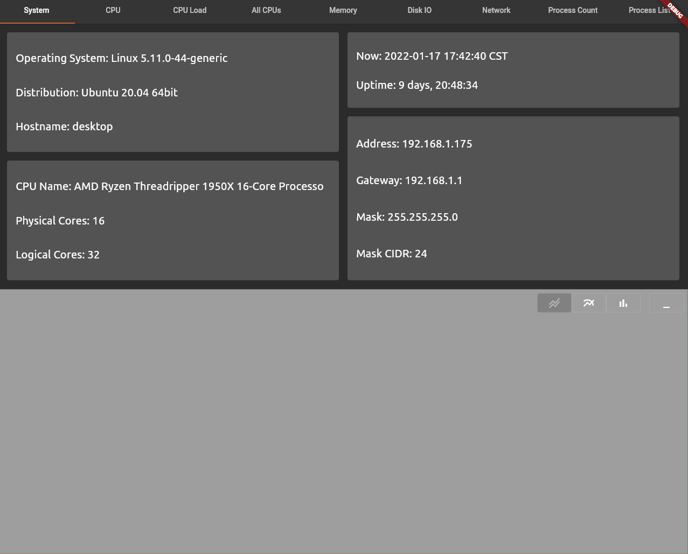

# glances_dashboard - Flutter Based Glances System Monitor

A work-in-progress system monitor that utilizes the [glances](https://nicolargo.github.io/glances/) JSON API to graph
statistics about system resource usage.  The charting functionality is not implemented yet but the backend models and
of value streaming features have been written.



##Features
The backend parses the JSON returned from the server to immutable Dart datastructures by using the deserialization
features provided by the [Built Value](https://github.com/google/built_value.dart) and [Built Collection](https://github.com/google/built_collection.dart)
projects.  Models are included for all the data provided by the server:
- now
- uptime
- plugins
- cores
- cpu
- cpu history
- per cpu
- per cpu history
- cpu load
- cpu load history
- disk IO
- disk IO history
- filesystem
- filesystem history
- IP
- memory
- memory history
- memory swap
- memory swap history
- network interface
- network interface history
- process count
- process count history
- process list
- quick look
- quick look history
- sensors
- system

By default, the glances server is polled once per second and a Stream of models is collected.  This Stream is then
normalized in to a BuiltMap for charting.

##Usage

First follow the directions for installing glances from the repository page [here](https://github.com/nicolargo/glances).
For most users if you already have Python and pip installed this is simply:

```basg
pip install --user glances
```

Next start the server without the web UI:

```bash
glances -w --disable-webui
```

There are several tests for the backend data models and the streaming functionality used to provide a history of the
system resource statistics.  A very basic Flutter UI is implemented but this does not include the charting yet.

1. Instructions for installing Flutter for Linux are [here](https://docs.flutter.dev/get-started/install/linux)

2. Activate the beta channel
```bash
flutter channel beta
flutter upgrade
```

3. Enable linux binary building
```bash
flutter config --enable-linux-desktop
```

4. Clone this repo
```bash
git clone
```

5. Change to the repo directory
```bash
cd apod
```

6. Update dependencies
```bash
flutter pub get
```

7. Run the tests
```bash
flutter test
```

8. Run the application
```bash
flutter run -d linux
```

Tested on:
 - Ubuntu 20.04.3 LTS
 - Flutter 2.13.0-0.2.pre • channel beta • https://github.com/flutter/flutter.git
 - Framework • revision 8662e22bac (2 days ago) • 2022-04-20 08:21:52 -0700
 - Engine • revision 24a02fa5ee
 - Tools • Dart 2.17.0 (build 2.17.0-266.5.beta) • DevTools 2.12.2
